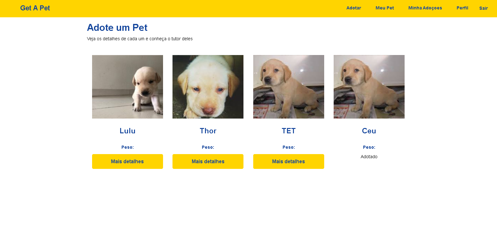
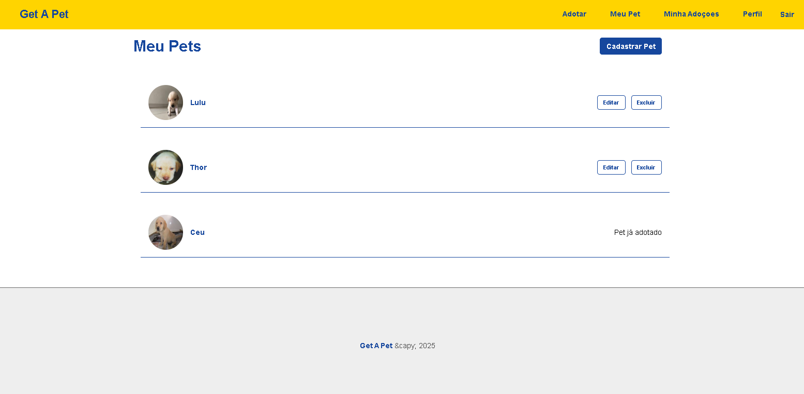
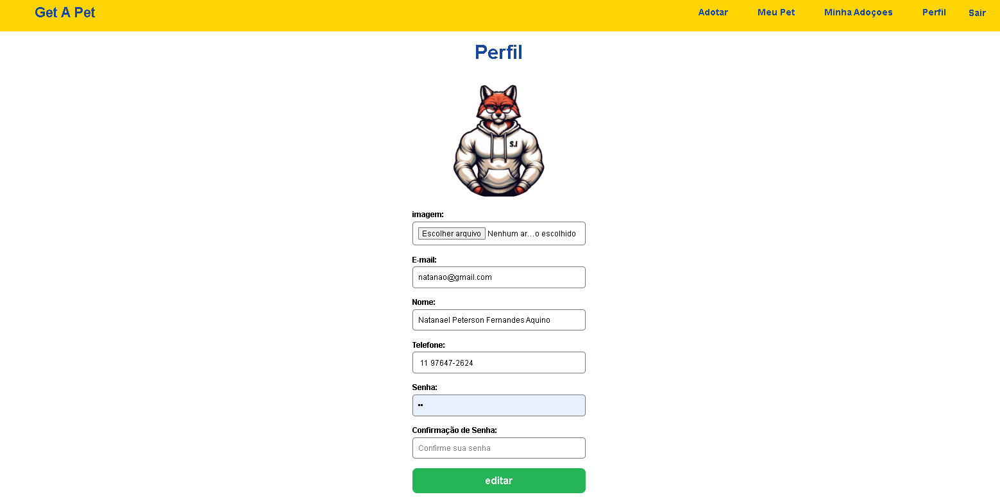

# Projeto PET 🐾

Este é um projeto **Full Stack** desenvolvido com **React** no frontend e **Node.js + Express + MongoDB** no backend. O objetivo principal é gerenciar informações de pets — como cadastro, listagem e upload de imagem — unindo uma interface moderna com uma API robusta.

---

## 🚀 Tecnologias Utilizadas

### 🧠 Backend (Node.js)
- **Express** – Framework web para criação da API
- **MongoDB + Mongoose** – Banco de dados NoSQL com ODM
- **JWT (jsonwebtoken)** – Autenticação baseada em tokens
- **bcrypt / bcryptjs** – Criptografia de senhas
- **Multer** – Upload de arquivos (ex: fotos dos pets)
- **CORS** – Liberação de acesso entre domínios
- **Nodemon** – Monitoramento automático da aplicação

### 🎨 Frontend (React)
- **React 19** – Biblioteca para construção da UI
- **React Router DOM v7** – Gerenciamento de rotas
- **Axios** – Requisições HTTP para a API
- **React Icons** – Ícones SVG para a interface
- **Testing Library (Jest + DOM + UserEvent)** – Ferramentas de teste
- **Events** – Manipulação de eventos customizados
- **Web Vitals** – Medição de performance

---

## 📁 Estrutura do Projeto

Projeto_PET/ ├── backend/ # API (Node.js + MongoDB) │ ├── routes/ │ ├── controllers/ │ ├── models/ │ └── index.js ├── frontend/ # Interface React │ ├── public/ │ ├── src/ │ │ ├── components/ │ │ ├── pages/ │ │ └── App.jsx ├── img/ # Imagens e uploads └── README.md

---

## ✅ Funcionalidades

- Cadastro de pets com imagem
- Login com autenticação JWT
- Listagem de pets cadastrados
- Comunicação frontend <-> backend via API
- Criptografia de senhas
- Upload de imagens com Multer

---

## ⚙️ Como Rodar o Projeto

Backend (Node.js)
cd backend
npm install
npm start
O backend será iniciado em http://localhost:3000

Frontend (React)
cd ../frontend
npm install
npm run dev


.env (Exemplo)
MONGODB_URI=mongodb://localhost:27017/pet_db
JWT_SECRET=sua_chave_secreta_aqui
PORT=3000

🖼️ Prints do Projeto 




### 1. Clone o repositório

```bash
git clone https://github.com/NatanaelAquino/Projeto_PET.git
cd Projeto_PET


📄 Licença
Projeto livre sob licença MIT.

Feito com 💙 por Natanael Aquino
